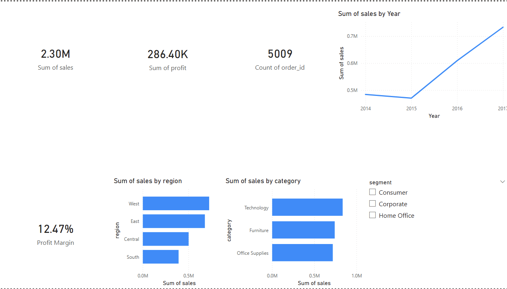

# 📊 Sales Performance Dashboard

> An interactive Power BI dashboard tracking 15+ KPIs across product categories, regions, and time periods — built on 9,994 real sales transactions using PostgreSQL and DAX.

---

## 📸 Dashboard Preview



---

## 🎯 Project Objective

Analyze retail sales data to:
- Track revenue, profit, and order volume across time
- Identify top-performing regions and product categories
- Enable leadership to filter and explore data by customer segment
- Surface revenue trends and profitability gaps in real time

---

## 🔍 Key Insights

| Insight | Finding |
|---|---|
| 💰 Total Revenue | **$2.30M** across all regions |
| 📈 Total Profit | **$286.40K** net profit |
| 🛒 Total Orders | **5,009** unique orders |
| 📊 Profit Margin | **12.47%** overall margin |
| 🏆 Top Region | West leads in total sales |
| 🥇 Top Category | Technology drives highest revenue |
| 📅 Growth Trend | Consistent YoY growth from 2014 → 2017 |

---

## 🛠️ Tech Stack

| Tool | Usage |
|---|---|
| **PostgreSQL** | Data storage & SQL transformation |
| **Power BI Desktop** | Dashboard & visualizations |
| **DAX** | Custom measures (Profit Margin) |
| **Python** | Data cleaning & encoding fix |
| **pandas** | CSV preprocessing |

---

## 📁 Project Structure

```
sales-performance-dashboard/
│
├── data/
│   └── superstore_clean.csv         # Cleaned dataset (9,994 rows)
│
├── sql/
│   └── sales_queries.sql            # SQL setup & analysis queries
│
├── dashboard/
│   └── sales_dashboard.pbix         # Power BI dashboard file
│
├── screenshots/
│   └── dashboard.png                # Dashboard preview
│
└── README.md
```

---

## ⚙️ How to Run

### 1. Setup PostgreSQL Database

```bash
psql -U postgres -c "CREATE DATABASE sales_performance;"
```

### 2. Create Table

```sql
CREATE TABLE sales (
    row_id INTEGER PRIMARY KEY,
    order_id VARCHAR(20),
    order_date DATE,
    ship_date DATE,
    ship_mode VARCHAR(50),
    customer_id VARCHAR(20),
    customer_name VARCHAR(100),
    segment VARCHAR(50),
    country VARCHAR(50),
    city VARCHAR(50),
    state VARCHAR(50),
    postal_code VARCHAR(20),
    region VARCHAR(20),
    product_id VARCHAR(20),
    category VARCHAR(50),
    sub_category VARCHAR(50),
    product_name VARCHAR(200),
    sales NUMERIC(10,2),
    quantity INTEGER,
    discount NUMERIC(4,2),
    profit NUMERIC(10,2)
);
```

### 3. Import Data

```bash
psql -U postgres -d sales_performance -c "\COPY sales FROM 'superstore_clean.csv' DELIMITER ',' CSV HEADER;"
```

### 4. Open Power BI

- Open `sales_dashboard.pbix` in Power BI Desktop
- Update the PostgreSQL connection to your local server

---

## 📈 DAX Measures

```dax
-- Profit Margin
Profit Margin = DIVIDE(SUM('public sales'[profit]), SUM('public sales'[sales]))
```

---

## 📊 Dashboard Features

- **4 KPI Cards** — Total Sales, Total Profit, Total Orders, Profit Margin
- **Line Chart** — Sales trend from 2014 to 2017
- **Bar Chart** — Sales by region (West, East, Central, South)
- **Bar Chart** — Sales by category (Technology, Furniture, Office Supplies)
- **Slicer** — Filter all visuals by customer segment (Consumer / Corporate / Home Office)

---

## 📦 Dataset

- **Source:** [Superstore Dataset — Kaggle](https://www.kaggle.com/datasets/vivek468/superstore-dataset-final)
- **Size:** 9,994 rows × 21 columns
- **Type:** US retail sales transactions (2014–2017)

---

## 💡 Business Recommendations

1. **Invest more in Technology** — highest revenue category
2. **Focus on West and East regions** — top revenue generators
3. **Improve Central and South margins** — underperforming regions
4. **Target Corporate segment** — higher avg order value than Consumer

---

## 👤 Author

**Wagih Emad (Goose)**
BI Developer | Data Analyst
> *Building data-driven solutions for real business problems.*
